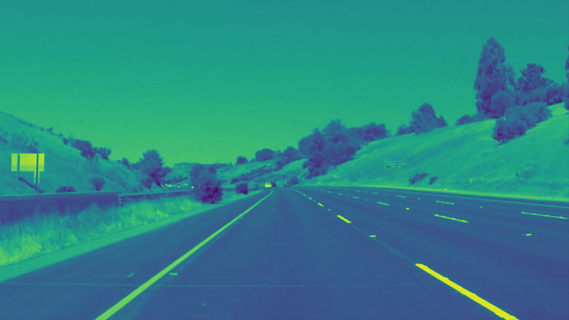
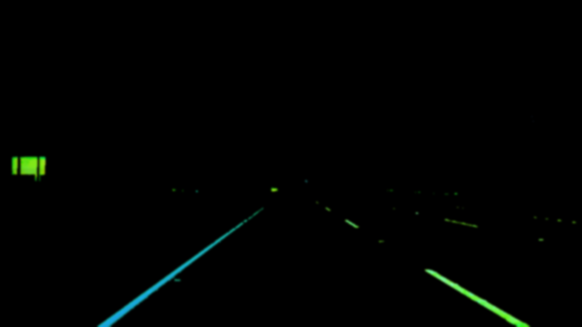
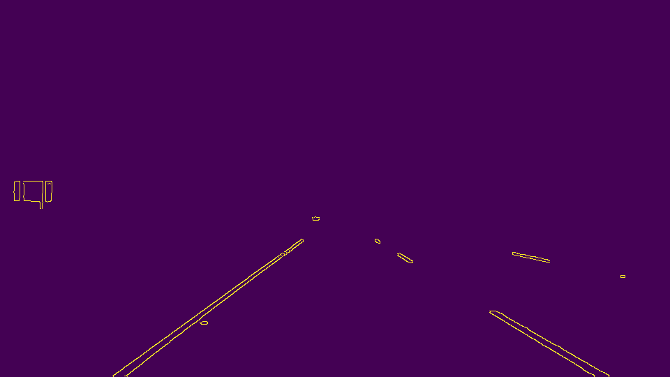
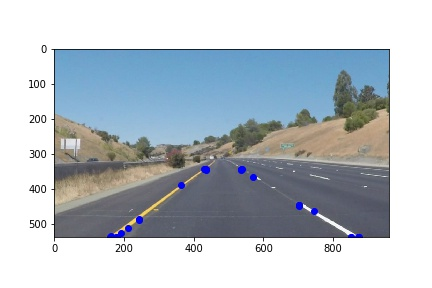
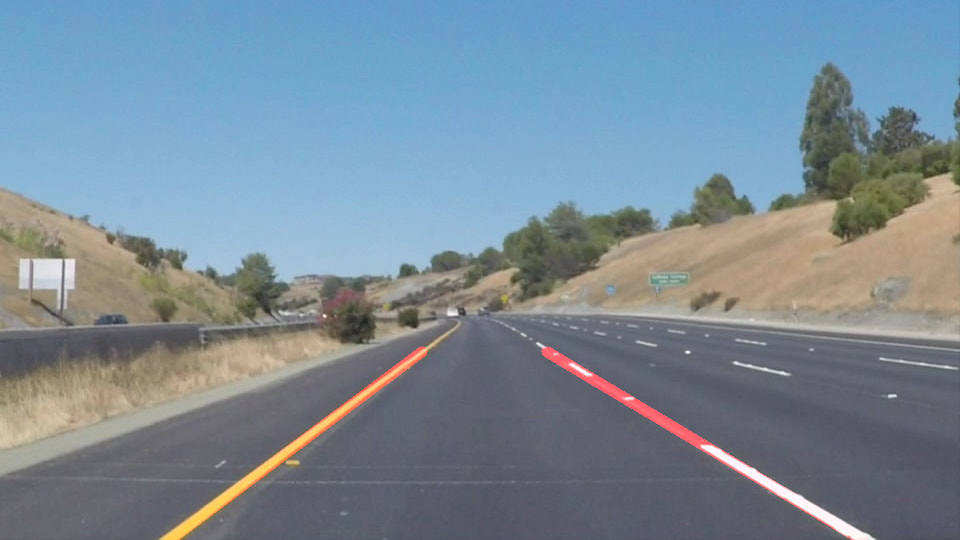

# **Finding Lane Lines on the Road** 

## Writeup Template

### You can use this file as a template for your writeup if you want to submit it as a markdown file. But feel free to use some other method and submit a pdf if you prefer.

---

**Finding Lane Lines on the Road**

The goals / steps of this project are the following:
* Make a pipeline that finds lane lines on the road
* Reflect on your work in a written report

[//]: # (Image References)

[image1]: ./examples/hslsolidYellowCurve2.jpg "Grayscale"

---

### Reflection

My pipeline consisted of 5 steps. 
1. Color Selection using below color maps
    a. HSL conversion
    b. Grayscale 
2. Gaussian Blur
3. Canny Edge detection Algorithm
4. Hough Transform
5. Lane extrapolation and lane fitting

### Color Selection
First, I converted the images to grayscale to decrease the number of channels to work with. But this pipeline doesn't work well for images with non-contrasting backgrounds and lanes with shadows and gray background. In order to deal with this I converted the images to HSL color space.

GrayScale Image:

HSL Image:

In the above image yellow and white lanes are identified very cleary.
I converted the images from RGB to HLS color space. Now I defined ranges for yellow and white masks. Combined these masks to select white and yellow lanes. 

### Gaussian Blur 
Here I have used a kernel size of 9.

hlsimage after Gaussian Blurring:

### Canny Edge Detection 

Goal is to identify lanes in the above image. For this I have used Canny Edge Detection algorithm.
Canny Recommended a ratio of 1:2 or 1:3 for low vs high thresholds. After many trail and errors I found that 50:150 as suitable thresholds for this algorithm to detect edges clearly.

HSL Image with Canny Edge detection:

In the above images Lanes are identified clearly but there is some unwanted noise also present. In order to remove that noise I have applied Region Of Interest mask to  the images after Canny edge detection.

HSL Image with Edges after Applying Region of Interest:

 In the above image edges are identified clearly without any noise.
 
### Hough Transform
From the detected edges we need to identify Lanes. Hough transform can be used to extract lanes from the edges. The output of Hough transform is a vector of line segments in the form of (x1,y1,x2,y2) as endpoints as shown in the below figure. 
Note: In the given helper functions pipeline I've modified the Houghlines function as it will return lines from Hough transform.

Hough Line Points:

### Lane Extrapolation and Lane Fitting
Hough transform gives to a vector of line segments (x1,y1,x2,y2) as endpoints.
I regrouped these points as left lane and right lane by finding the slopes.
Finally I fitted two lanes(left lane and right lane) by using numpy.polyfit function which returns the slope and intercepts of left and right fitted lanes. 
I've defined ymax and ymin to be in the middle of the image. From thes y points I calculated the xmin and xmax points for both left and right lanes.
From these x and y coordiantes I plotted a line using openCV function cv2.line()

Finally I draw these lines on the original image using cv2.addWeighted() function.

Images with detected lanes:

"SolidYellowCurve2"

"SolidWhiteCurve"

"SolidWhiteRight"

"SolidYellowCurve" 

"SolidYellowLeft" 

"WhiteCarLaneSwitch" 

Finally I used this pipeline to work on images. Now my pipelines clearly identifies and annotates the lanes in the three given test videos.

### 2. shortcomings and Improvements

There are some shortcomings since this pipeline will not work correctly for Steep roads and Lanes that are not Yellow and white. There are some jitters found the video. In order to overcome these jitters we can use deque method to limit and avergae the lane lines. I am still working on imorovements to this pipeline.

